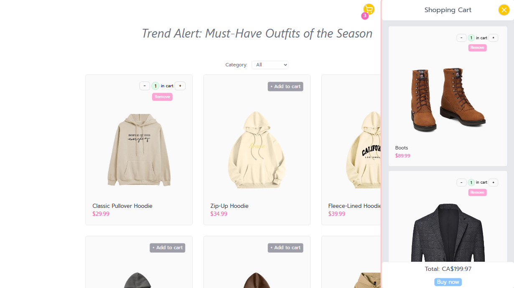
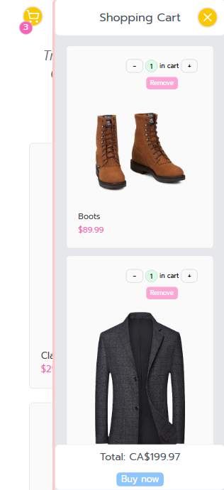

# Shopping Cart

## Overview
A responsive online shopping site UI sample featuring a modern layout for browsing products. Designed to provide a seamless and visually appealing shopping experience across all devices.

### Features

- Show items
- Filter items by categories
- Add/remove items to/from shopping cart
- Show/hide shopping cart
- Show total number of items in shopping cart
- Show total price
- Responsive design

---

## Screenshots

Desktop

  
   
  

 

Mobile

  
  

